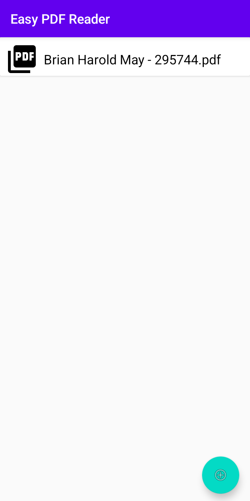
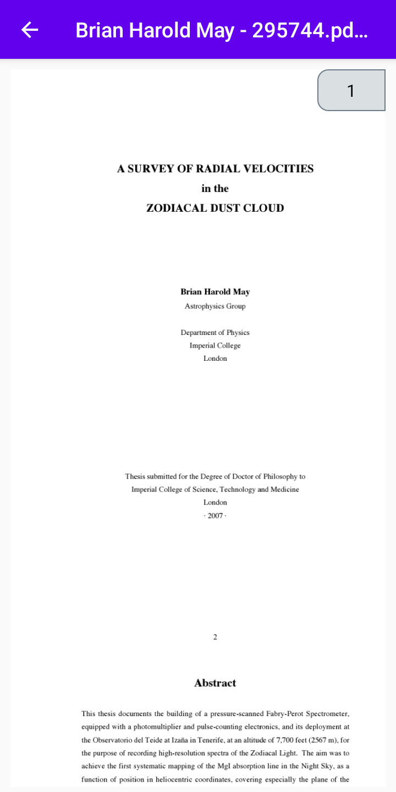

# EasyPDFReader-Android-App-Kotlin
## This is a soft fork originally created by `Aalishan Ansari` a.k.a `Aalishan565`
## Here is the original link 
`https://github.com/Aalishan565/EasyPDFReader-Android-App-Kotlin`

# Description
EasyPDFReader is a simple and efficient PDF reader application for Android, built using Kotlin. It allows users to browse and read PDF files stored on their device with ease.

## Features

- Browse PDF files on the device
- View PDF files with smooth scrolling and zooming
- Support for Android 5.0 (Lollipop) and above
- Adaptive layout for various screen sizes
- Dark mode support (not implemented yet)

## Screenshots

### Home Page


### Detail View


## Technologies and Libraries Used

- Kotlin
- Android Jetpack
  - ViewModel
  - LiveData
  - View Binding
- Coroutines for asynchronous operations
- [AndroidPdfViewer](https://github.com/barteksc/AndroidPdfViewer) for rendering PDF files
- RecyclerView for displaying the list of PDF files
- CardView for material design cards in the PDF list

## Project Structure

The project follows the MVVM (Model-View-ViewModel) architecture pattern and is organized as follows:

- `app/src/main/java/com/easypdfreader/`
  - `MainListActivity.kt`: The main activity that displays the list of PDF files
  - `PdfListAdapter.kt`: RecyclerView adapter for the PDF file list
  - `PdfViewActivity.kt`: Activity for viewing individual PDF files
- `app/src/main/res/`
  - `layout/`: XML layout files for the activities and list items
  - `values/`: Resource files for strings, colors, and styles

## Setup and Installation

1. Clone the repository:
   ```
   git clone https://github.com/malcolmreed-ent/EasyPDFReader-Android-App-Kotlin.git
   ```
2. Open the project in Android Studio.
3. Build and run the app on an emulator or physical device.

## Permissions

The app requires the following permissions:

- `READ_EXTERNAL_STORAGE`: To access PDF files stored on the device
- `MANAGE_EXTERNAL_STORAGE`: For Android 11+ to access all files (optional, depending on your implementation)

## Contributing

Contributions are welcome! Please feel free to submit a Pull Request.

## License

This project is licensed under the MIT License - see the [LICENSE](LICENSE) file for details.

## Acknowledgments

- [AndroidPdfViewer](https://github.com/barteksc/AndroidPdfViewer) library for PDF rendering
- [Material Design](https://material.io/design) for the app's visual language

## Contact

If you have any questions or suggestions, please open an issue or contact the maintainer at [your-email@example.com](mailto:your-email@example.com).
